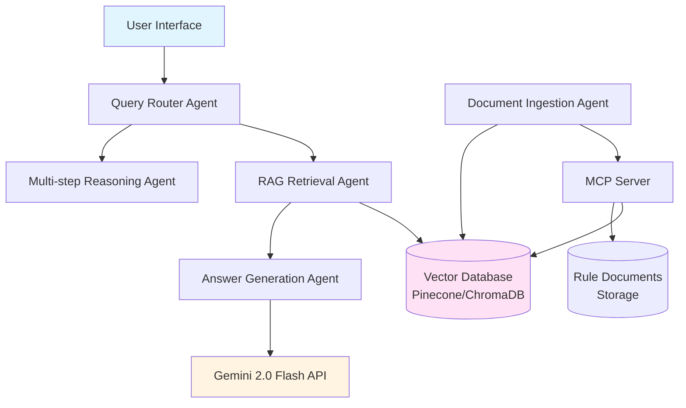

# I want to create a chat bot that I will give access to so that it can answer questions about boardgame rules. I want to use Google agent development kit to build the agent. I also want to use MCPs for this and a vector db. Please give me the prompts I should use in order to build this project


Based on current information about Google's Agent Development Kit, MCPs, and vector databases, here are the prompts you should use to build your boardgame rules chatbot project:

## Project Build Prompts

### 1. **Architecture Design Prompt**

```
Design a multi-agent architecture for a boardgame rules chatbot using Google's Agent Development Kit (ADK). The system should:

- Use Model Context Protocol (MCP) servers to access boardgame rule documents
- Implement a vector database (Pinecone or ChromaDB) for semantic search of rules
- Create specialized agents for:
  1. Document ingestion and embedding
  2. Query understanding and routing
  3. Rule retrieval and context assembly
  4. Response generation with citations

Provide the system architecture diagram and explain how agents will communicate.
```


### 2. **MCP Server Setup Prompt**

```
Create an MCP server implementation for boardgame rules access that:

- Exposes tools for rule document CRUD operations
- Provides knowledge resources for accessing rule PDFs/markdown files
- Implements prompts for common boardgame rule queries
- Uses JSON-RPC 2.0 for communication
- Supports both local (STDIO) and remote (HTTP+SSE) transport

Include Python code using the MCP SDK with proper error handling and authentication.
```


### 3. **Vector Database Integration Prompt**

```
Build a vector database integration for boardgame rules using ADK that:

- Chunks rule documents into semantic sections (by game phase, component, or topic)
- Generates embeddings using Gemini embedding models (text-embedding-004)
- Stores vectors in [Pinecone/ChromaDB/Vertex AI Vector Search]
- Implements hybrid search (vector + keyword) for better precision
- Handles metadata filtering by game name, player count, and rule category

Provide the embedding pipeline code and retrieval logic.
```


### 4. **Data Ingestion Agent Prompt**

```
Create an ADK Sequential agent for boardgame rule ingestion that:

1. Accepts PDF/markdown rule documents
2. Extracts text and preserves structure (sections, tables, diagrams)
3. Chunks content intelligently (preserve game phases, setup steps, scoring rules)
4. Generates embeddings via Gemini
5. Stores in vector DB with rich metadata (game name, version, page numbers)
6. Validates successful storage

Use ADK's tool ecosystem and include progress tracking.
```


### 5. **Query Router Agent Prompt**

```
Implement an LlmAgent using ADK that routes boardgame questions to appropriate handlers:

- Simple fact queries → Direct vector search
- Complex rule interactions → Multi-step reasoning agent
- Ambiguous questions → Clarification agent
- Game comparisons → Parallel search across multiple games

Use Gemini 2.0 Flash as the LLM and implement dynamic transfer logic between agents.
Include examples of routing decisions.
```


### 6. **RAG Retrieval Agent Prompt**

```
Build a Retrieval Augmented Generation (RAG) agent using Google ADK that:

- Accepts natural language questions about boardgame rules
- Generates query embeddings
- Retrieves top-k most relevant rule chunks from vector DB (k=5-10)
- Re-ranks results using Gemini
- Constructs context window with retrieved rules
- Generates accurate answers with source citations (page numbers, game sections)

Implement error handling for no-match scenarios and ambiguous queries.
```


### 7. **Multi-Agent Orchestration Prompt**

```
Design the main orchestration agent using ADK that coordinates:

1. **Rule Loader Agent** (background) - Periodic rule updates via MCP
2. **Query Agent** (on-demand) - Processes user questions
3. **Retrieval Agent** (tool) - Fetches relevant rules from vector DB
4. **Answer Agent** (LLM) - Generates user-friendly responses

Use ADK's Sequential and Parallel workflows where appropriate.
Include state management for conversation context and multi-turn dialogues.
```


### 8. **MCP Knowledge Resource Prompt**

```
Create MCP knowledge resources for boardgame rules that provide:

- Resource URIs for each game's rulebook (e.g., mcp://rules/catan/v1)
- Structured access to rule sections via templates
- Metadata about game complexity, player count, duration
- Search capabilities across all indexed games

Implement using the MCP server SDK with proper resource discovery.
```


### 9. **Evaluation \& Testing Prompt**

```
Implement ADK's evaluation framework for the boardgame chatbot:

- Create test cases with questions and expected answers for popular games
- Evaluate retrieval accuracy (precision@k, recall@k)
- Test response quality using LLM-as-judge pattern
- Measure trajectory correctness (did agents route properly?)
- Include edge cases: unknown games, contradictory rules, version differences

Provide evaluation metrics and test dataset format.
```


### 10. **Deployment Configuration Prompt**

```
Configure deployment for the boardgame rules chatbot using ADK:

- Containerize with Docker including all dependencies
- Deploy to Vertex AI Agent Engine for scalability
- Set up environment variables for:
  - Gemini API keys
  - Vector DB credentials
  - MCP server endpoints
- Implement Cloud Run for web API exposure
- Configure monitoring and logging

Provide Dockerfile, deployment YAML, and infrastructure-as-code (Terraform/CDK).
```


### 11. **Conversation Memory Prompt**

```
Implement conversation memory for multi-turn dialogues:

- Track which game the user is asking about across turns
- Remember previous clarifications and preferences
- Store conversation state in ADK agent context
- Handle context switching between different games
- Implement conversation summarization for long sessions

Use ADK's state management patterns.
```


### 12. **Security \& Safety Prompt**

```
Implement security and safety patterns for the boardgame chatbot:

- Input validation to prevent prompt injection
- Rate limiting for MCP server calls
- Authentication for admin operations (rule uploads)
- Content filtering to prevent inappropriate responses
- Audit logging for all rule queries and modifications
- Data privacy for user conversations

Follow ADK's security best practices and Google Cloud security patterns.
```


## Implementation Order

I recommend executing these prompts in this sequence:

1. **Architecture Design** (Prompt 1)
2. **Vector Database Integration** (Prompt 3)
3. **Data Ingestion Agent** (Prompt 4)
4. **MCP Server Setup** (Prompt 2)
5. **RAG Retrieval Agent** (Prompt 6)
6. **Query Router Agent** (Prompt 5)
7. **Multi-Agent Orchestration** (Prompt 7)
8. **MCP Knowledge Resource** (Prompt 8)
9. **Conversation Memory** (Prompt 11)
10. **Security \& Safety** (Prompt 12)
11. **Evaluation \& Testing** (Prompt 9)
12. **Deployment Configuration** (Prompt 10)

## Additional Considerations

**Vector Database Choice**: Given your AWS/GCP experience, I'd recommend:

- **Pinecone** - Managed, easy integration, great for prototyping
- **Vertex AI Vector Search** - Native GCP integration with ADK
- **ChromaDB** - Open-source, good for local development

**MCP vs Direct Integration**: MCP provides standardization, but you could also directly integrate using ADK tools. Use MCP if you plan to support multiple clients or want to share your rule server with other AI applications.

Would you like me to expand on any specific prompt or provide actual code examples for implementing any of these components?
<span style="display:none">[^1_1][^1_10][^1_11][^1_12][^1_13][^1_14][^1_15][^1_16][^1_17][^1_18][^1_19][^1_2][^1_20][^1_3][^1_4][^1_5][^1_6][^1_7][^1_8][^1_9]</span>

<div align="center">⁂</div>

[^1_1]: https://google.github.io/adk-docs/

[^1_2]: https://developers.googleblog.com/en/agent-development-kit-easy-to-build-multi-agent-applications/

[^1_3]: https://docs.cloud.google.com/vertex-ai/generative-ai/docs/agent-development-kit/overview

[^1_4]: https://cloud.google.com/blog/products/ai-machine-learning/build-and-manage-multi-system-agents-with-vertex-ai

[^1_5]: https://datacommons.substack.com/p/plug-and-play-earth-engine-search

[^1_6]: https://www.infracloud.io/blogs/model-context-protocol-simplifying-llm-integration/

[^1_7]: https://robkerr.ai/generative-ai-chatbot-grounding-data-vector-text/

[^1_8]: https://google.github.io/adk-docs/agents/

[^1_9]: https://www.descope.com/learn/post/mcp

[^1_10]: https://docs.langflow.org/chat-with-rag

[^1_11]: https://cloud.google.com/blog/products/ai-machine-learning/build-multi-agentic-systems-using-google-adk

[^1_12]: https://www.microsoft.com/en-us/microsoft-copilot/blog/copilot-studio/introducing-model-context-protocol-mcp-in-copilot-studio-simplified-integration-with-ai-apps-and-agents/

[^1_13]: https://docs.featureform.com/llms-embeddings-and-vector-databases/building-a-chatbot-with-openai-and-a-vector-database

[^1_14]: https://www.youtube.com/watch?v=lCTVvHWkVAI

[^1_15]: https://modelcontextprotocol.io

[^1_16]: https://www.youtube.com/watch?v=KhyXFfoEVtM

[^1_17]: https://www.anthropic.com/news/model-context-protocol

[^1_18]: https://docs.pinecone.io/guides/get-started/build-a-rag-chatbot

[^1_19]: https://github.com/modelcontextprotocol

[^1_20]: https://zilliz.com/learn/build-interactive-AI-chatbots-with-vector-database


---

# multiple you add in the prompt that a diagram must be generated. which service can I use for this, ideally a free service

Perfect! Here are the **best free services** for diagram generation and the **updated prompts** with diagram requirements:

## Recommended Free Diagram Services

### **Best Options:**

1. **Mermaid.js** ⭐ **(Recommended)**
    - Text-to-diagram using markdown-like syntax
    - Can be embedded directly in markdown/GitHub
    - Works with ChatGPT/Claude to auto-generate diagrams
    - **Free editors:**
        - [Mermaid Live Editor](https://mermaid.live) - Official editor
        - [Mermaid Flow](https://www.mermaidflow.app) - Visual + AI-powered
        - [Eraser.io](https://www.eraser.io) - AI architecture diagrams
2. **Diagrams.net (draw.io)** ⭐
    - Completely free, no account needed
    - Desktop app + web version
    - [app.diagrams.net](https://app.diagrams.net)
    - Integrates with Google Drive, GitHub
3. **PlantUML**
    - Code-based diagrams
    - Version-controllable
    - Great for technical architecture

***

## Updated Prompts with Diagram Generation

### **1. Architecture Design Prompt (UPDATED)**

```
Design a multi-agent architecture for a boardgame rules chatbot using Google's Agent Development Kit (ADK). The system should:

- Use Model Context Protocol (MCP) servers to access boardgame rule documents
- Implement a vector database (Pinecone or ChromaDB) for semantic search of rules
- Create specialized agents for:
  1. Document ingestion and embedding
  2. Query understanding and routing
  3. Rule retrieval and context assembly
  4. Response generation with citations

**GENERATE THREE DIAGRAMS:**

1. **System Architecture Diagram** (Mermaid flowchart):
   - Show all components: User Interface, ADK Agents, MCP Servers, Vector DB, LLM
   - Display data flow between components
   - Include external dependencies (Gemini API, storage)

2. **Agent Communication Flow** (Mermaid sequence diagram):
   - User query → Query Router Agent → Retrieval Agent → Vector DB → Answer Agent
   - Show message passing and tool calls
   - Include error handling paths

3. **MCP Integration Diagram** (Mermaid C4 or component diagram):
   - MCP server endpoints and resources
   - Transport layer (STDIO vs HTTP+SSE)
   - Connection to ADK agent tools

Provide Mermaid code for all diagrams that can be rendered at mermaid.live
```


***

### **2. MCP Server Setup Prompt (UPDATED)**

```
Create an MCP server implementation for boardgame rules access that:

- Exposes tools for rule document CRUD operations
- Provides knowledge resources for accessing rule PDFs/markdown files
- Implements prompts for common boardgame rule queries
- Uses JSON-RPC 2.0 for communication
- Supports both local (STDIO) and remote (HTTP+SSE) transport

**GENERATE DIAGRAM:**

Create a Mermaid class diagram showing:
- MCP Server class structure
- Tool interfaces (list_rules, search_rules, get_rule_section)
- Resource handlers (rule URIs, metadata)
- Transport layer abstractions

Include Python code using the MCP SDK with proper error handling and authentication.
Export diagram as Mermaid code.
```


***

### **3. Vector Database Integration Prompt (UPDATED)**

```
Build a vector database integration for boardgame rules using ADK that:

- Chunks rule documents into semantic sections (by game phase, component, or topic)
- Generates embeddings using Gemini embedding models (text-embedding-004)
- Stores vectors in [Pinecone/ChromaDB/Vertex AI Vector Search]
- Implements hybrid search (vector + keyword) for better precision
- Handles metadata filtering by game name, player count, and rule category

**GENERATE DIAGRAMS:**

1. **Data Pipeline Diagram** (Mermaid flowchart):
   - PDF/Markdown → Text Extraction → Chunking → Embedding → Vector Storage
   - Include error handling and validation steps

2. **Retrieval Flow Diagram** (Mermaid sequence):
   - Query → Embedding → Vector Search → Re-ranking → Context Assembly
   - Show metadata filtering logic

Provide the embedding pipeline code and retrieval logic.
Export diagrams as Mermaid code that can be copied to mermaid.live
```


***

### **4. Data Ingestion Agent Prompt (UPDATED)**

```
Create an ADK Sequential agent for boardgame rule ingestion that:

1. Accepts PDF/markdown rule documents
2. Extracts text and preserves structure (sections, tables, diagrams)
3. Chunks content intelligently (preserve game phases, setup steps, scoring rules)
4. Generates embeddings via Gemini
5. Stores in vector DB with rich metadata (game name, version, page numbers)
6. Validates successful storage

**GENERATE DIAGRAM:**

Create a Mermaid state diagram showing:
- Agent states: Idle → Processing → Extracting → Chunking → Embedding → Storing → Complete
- Transition conditions and error states
- Retry logic for failures

Use ADK's tool ecosystem and include progress tracking.
Provide Mermaid code for the diagram.
```


***

### **5. Query Router Agent Prompt (UPDATED)**

```
Implement an LlmAgent using ADK that routes boardgame questions to appropriate handlers:

- Simple fact queries → Direct vector search
- Complex rule interactions → Multi-step reasoning agent
- Ambiguous questions → Clarification agent
- Game comparisons → Parallel search across multiple games

**GENERATE DIAGRAMS:**

1. **Decision Tree Diagram** (Mermaid flowchart):
   - Query classification logic
   - Routing decisions with confidence thresholds
   - Fallback handlers

2. **Agent Interaction Graph** (Mermaid graph):
   - Router Agent as central hub
   - Connected specialized agents (RAG, Reasoning, Clarification, Comparison)
   - Transfer conditions

Use Gemini 2.0 Flash as the LLM and implement dynamic transfer logic.
Export as Mermaid code with examples of routing decisions.
```


***

### **7. Multi-Agent Orchestration Prompt (UPDATED)**

```
Design the main orchestration agent using ADK that coordinates:

1. **Rule Loader Agent** (background) - Periodic rule updates via MCP
2. **Query Agent** (on-demand) - Processes user questions
3. **Retrieval Agent** (tool) - Fetches relevant rules from vector DB
4. **Answer Agent** (LLM) - Generates user-friendly responses

**GENERATE DIAGRAMS:**

1. **Agent Orchestration Diagram** (Mermaid flowchart):
   - Main orchestrator and sub-agents
   - Sequential vs Parallel execution paths
   - State management flow

2. **Multi-turn Conversation Flow** (Mermaid sequence):
   - Show 3-turn dialogue example
   - Context passing between turns
   - Memory updates

Use ADK's Sequential and Parallel workflows where appropriate.
Provide Mermaid code for both diagrams.
```


***

### **9. Evaluation \& Testing Prompt (UPDATED)**

```
Implement ADK's evaluation framework for the boardgame chatbot:

- Create test cases with questions and expected answers for popular games
- Evaluate retrieval accuracy (precision@k, recall@k)
- Test response quality using LLM-as-judge pattern
- Measure trajectory correctness (did agents route properly?)
- Include edge cases: unknown games, contradictory rules, version differences

**GENERATE DIAGRAM:**

Create a Mermaid flowchart showing the evaluation pipeline:
- Test data loading
- Metric calculation branches (retrieval, quality, routing)
- Aggregation and reporting
- Failure analysis loop

Provide evaluation metrics, test dataset format, and Mermaid code.
```


***

### **10. Deployment Configuration Prompt (UPDATED)**

```
Configure deployment for the boardgame rules chatbot using ADK:

- Containerize with Docker including all dependencies
- Deploy to Vertex AI Agent Engine for scalability
- Set up environment variables for:
  - Gemini API keys
  - Vector DB credentials
  - MCP server endpoints
- Implement Cloud Run for web API exposure
- Configure monitoring and logging

**GENERATE DIAGRAMS:**

1. **Deployment Architecture** (Mermaid C4 diagram):
   - Cloud Run containers
   - Vertex AI Agent Engine
   - Vector DB (managed service)
   - MCP servers
   - External APIs (Gemini)

2. **CI/CD Pipeline** (Mermaid flowchart):
   - GitHub → Build → Test → Deploy stages
   - Environment promotion (dev → staging → prod)

Provide Dockerfile, deployment YAML, infrastructure-as-code, and Mermaid diagrams.
```


***

## Quick Mermaid Example

Here's what you'd get from the architecture prompt:



You can paste this directly into [mermaid.live](https://mermaid.live) to see it rendered!

***

## How to Use These Services

**For Mermaid diagrams:**

1. Paste code into [mermaid.live](https://mermaid.live)
2. Export as PNG/SVG
3. Or embed directly in GitHub/documentation

**For draw.io:**

1. Go to [app.diagrams.net](https://app.diagrams.net)
2. Start with a template or blank canvas
3. Export as PNG/PDF/SVG

**Pro tip:** If you're using an AI assistant (like me!) to generate these prompts, you can ask it to directly output Mermaid code, which you can then visualize immediately in the live editor.

Would you like me to generate actual Mermaid code for any specific diagram right now?
<span style="display:none">[^2_1][^2_10][^2_11][^2_12][^2_13][^2_14][^2_15][^2_16][^2_17][^2_18][^2_19][^2_2][^2_20][^2_3][^2_4][^2_5][^2_6][^2_7][^2_8][^2_9]</span>

<div align="center">⁂</div>

[^2_1]: https://icepanel.io/blog/2025-09-03-top-8-diagramming-tools-for-software-architecture

[^2_2]: https://www.youtube.com/watch?v=GAUJG6Bgfd4

[^2_3]: https://www.docuwriter.ai/posts/free-uml-diagram-maker

[^2_4]: https://www.eraser.io/ai/architecture-diagram-generator

[^2_5]: https://www.cerbos.dev/blog/best-open-source-tools-software-architects

[^2_6]: https://miro.com/diagramming/mermaid-diagram/

[^2_7]: https://en.wikipedia.org/wiki/Diagrams.net

[^2_8]: https://www.redhat.com/en/blog/great-architectural-diagramming-tools

[^2_9]: https://www.mermaidflow.app

[^2_10]: https://www.youtube.com/watch?v=bN6i6dsoZTs

[^2_11]: https://www.g2.com/categories/diagramming/free

[^2_12]: https://mermaid.js.org

[^2_13]: https://www.drawio.com/blog

[^2_14]: https://www.reddit.com/r/softwarearchitecture/comments/1ddgo8w/what_softwareswebsites_you_use_for_designing_high/

[^2_15]: https://mermaidchart.com/play

[^2_16]: https://app.diagrams.net

[^2_17]: https://www.eraser.io/guides/best-ai-diagram-tools-in-2025

[^2_18]: https://mermaid.live

[^2_19]: https://www.drawio.com

[^2_20]: https://www.eraser.io/ai/mermaid-diagram-editor

